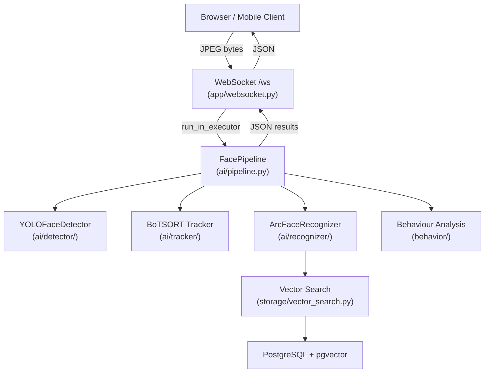

# FacePass AiService

> **Real-time face recognition and behaviour analysis** — Final-Year Engineering Project (PFE)

## Architecture Overview



## Project Structure

```
AiService/
├── ai/
│   ├── detector/
│   │   └── yolo_face.py         # YOLO face detection
│   ├── recognizer/
│   │   ├── arcface.py           # ArcFace 512-D embedding
│   │   └── embedding_cache.py   # LRU per-track cache
│   ├── tracker/
│   │   ├── bot_sort.py          # BoTSORT multi-object tracker
│   │   ├── matching.py          # IoU-based Hungarian matching
│   │   └── kalman.py            # Kalman filter state
│   ├── model_registry.py        # Versioned model path resolver
│   ├── pipeline.py              # Main pipeline orchestrator
│   └── types.py                 # Shared dataclasses
│
├── app/
│   └── websocket.py             # Async WebSocket handler
│
├── behavior/
│   ├── head_pose.py             # MediaPipe PnP pose estimation
│   └── engagement.py            # Engagement classification
│
├── configs/
│   ├── settings.py              # Pydantic settings (env override)
│   └── logging_config.py        # Rotating file + console logging
│
├── models/
│   ├── registry.json            # Model version registry
│   └── v1/
│       └── yolo_face.pt         # YOLOv5 face detection weights
│
├── storage/
│   ├── database.py              # SQLAlchemy engine + get_db()
│   ├── models.py                # ORM model (FaceEmbedding)
│   ├── repositories.py          # CRUD data-access layer
│   └── vector_search.py         # pgvector cosine search + NumPy fallback
│
├── tests/
│   ├── conftest.py              # Shared fixtures
│   ├── test_detector.py
│   ├── test_recognizer.py
│   ├── test_pipeline.py
│   ├── test_behavior.py
│   └── test_api.py
│
├── main.py                      # FastAPI app & REST endpoints
├── requirements.txt
├── requirements-dev.txt
├── pytest.ini
└── .env.example
```

## Quick Start

### 1. Clone & install

```bash
git clone <repo-url>
cd AiService

# Create virtual environment
python -m venv venv
venv\Scripts\activate          # Windows
# source venv/bin/activate     # Linux / macOS

pip install -r requirements.txt
```

### 2. Configure

```bash
copy .env.example .env
# Edit .env — set DATABASE_URL, DEVICE, etc.
```

### 3. Set up PostgreSQL + pgvector

```sql
CREATE DATABASE facepass;
\c facepass
CREATE EXTENSION vector;
```

### 4. Run

```bash
uvicorn main:app --host 0.0.0.0 --port 8000 --reload
```

## API Reference

| Method | Path | Description |
|--------|------|-------------|
| `GET` | `/health` | Liveness probe + DB connectivity |
| `GET` | `/info` | Service metadata & active model version |
| `POST` | `/enroll/{student_id}` | Store a 512-D ArcFace embedding |
| `GET` | `/students/{id}/embeddings` | List stored embedding IDs |
| `DELETE` | `/students/{id}` | Delete all embeddings for a student |
| `WS` | `/ws` | Real-time face analysis stream |

### WebSocket protocol

```
Client → Server : raw JPEG frame bytes
Server → Client : JSON array of per-face results
```

**Result schema:**

```json
[
  {
    "track_id": 1,
    "bbox": [50, 60, 200, 250],
    "student_id": 42,
    "confidence": 0.91,
    "pitch": -3.2,
    "yaw": 8.7,
    "roll": 1.0,
    "engagement": "high"
  }
]
```

## AI Pipeline

```
frame
  │
  ├─ [1] YOLOFaceDetector     → bounding boxes
  ├─ [2] BoTSORT Tracker       → stable track IDs
  ├─ [3] ArcFaceRecognizer     → 512-D embeddings  (every N frames)
  ├─ [4] cosine_search         → matched student_id
  └─ [5] Head Pose + Engagement → pitch/yaw/roll, engagement level
```

Each stage is independently timed and logged at `DEBUG` level:
```
2026-02-25T21:45:00 | DEBUG | ai.pipeline | [frame=42] faces=2 | detect=12ms track=1ms recog=18ms behav=4ms | total=35ms
```

## Running Tests

```bash
pip install -r requirements-dev.txt
pytest tests/ -v
```

Tests mock all heavy dependencies (YOLO, InsightFace, MediaPipe, PostgreSQL) and run without a GPU.

## Configuration Reference

All settings can be set via environment variables or `.env`:

| Variable | Default | Description |
|----------|---------|-------------|
| `DATABASE_URL` | *(required)* | PostgreSQL connection string |
| `DEVICE` | `cuda` | Inference device (`cuda`/`cpu`) |
| `MODEL_VERSION` | `v1` | Model version to load from registry |
| `EMBED_INTERVAL` | `15` | Frames between re-embeddings |
| `SIM_THRESHOLD` | `0.45` | Cosine distance identity threshold |
| `YAW_THRESHOLD` | `20.0` | Yaw angle for engagement drop |
| `PITCH_THRESHOLD` | `-10.0` | Pitch angle for engagement drop |
| `LOG_LEVEL` | `INFO` | Console log level |
| `LOG_FILE` | `logs/facepass.log` | Rotating log file path |

## Scaling Notes

The default setup handles ~10–20 concurrent WebSocket streams on a single GPU server.

For higher load:
- **Redis task queue**: Offload frame processing to Celery workers; see comments in `app/websocket.py`
- **FAISS**: Replace the NumPy brute-force fallback in `storage/vector_search.py` with FAISS `IndexFlatIP` for sub-millisecond search over millions of embeddings
- **Model versioning**: Register new model versions in `models/registry.json` and set `MODEL_VERSION` in `.env` — zero code changes needed

## Tech Stack

| Component | Technology |
|-----------|-----------|
| Web framework | FastAPI + Uvicorn |
| Face detection | YOLOv5 (custom weights) |
| Face recognition | InsightFace ArcFace (buffalo_l) |
| Tracking | BoTSORT (IoU + Hungarian) |
| Head pose | MediaPipe FaceMesh + PnP |
| Vector storage | PostgreSQL + pgvector |
| Configuration | Pydantic Settings |
| Testing | pytest + unittest.mock |
